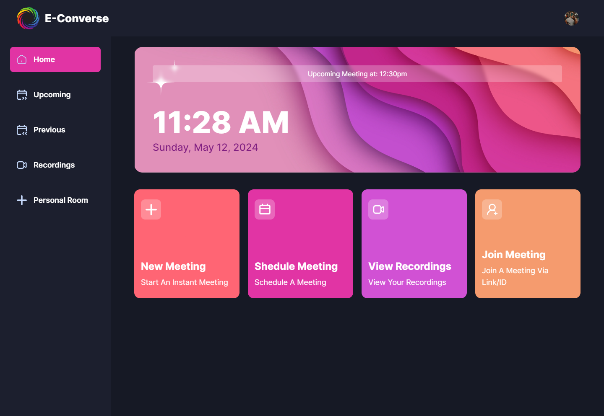

<h1 align='center'>
E-Converse
</h1>
<p align='center' style="font-size:1.5em; font-weight:bold;">
“Connect Beyond Borders - Your Gateway to Global Conversations!” 🌐✨
</p>

E-Converse is a cutting-edge video conferencing platform designed for today’s dynamic work environment. With a focus on speed, security, and user-friendly features, E-Converse ensures a seamless virtual meeting experience.
##### View Deployment: https://e-converse.vercel.app


## Features
#### High-Speed Performance:
 - Crystal-clear audio and HD video quality, even in low-bandwidth conditions.
 - Instant connection without lag or delays.
#### Advanced Features:
 - Smart Scheduling: Intuitive calendar integration for hassle-free meeting planning.
 - Screen Sharing: Share presentations, documents, or your entire screen effortlessly.
 - Recording and Transcription: Capture important discussions for future reference.


## Built With
<p align='center'> 


</p>

## Home Page ScreenShot
<p align='center'>


</p>

## Installation

#### Clone the Repository
```bash
git clone [project-name]
```

#### Install the Project Using
```bash
npm install
# or
yarn install
```

#### Run the Project Using
```bash
npm run dev
#or
yarn dev
```

#### View the local deployment at
```bash
http://localhost:3000
```

## Contributing

Please feel free to contribute to this repository. Contributions are always welcomed. 
Create a pull request incase you feel some more better changes could be made to the site and we will review your changes.
